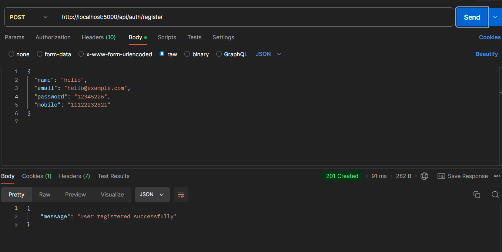
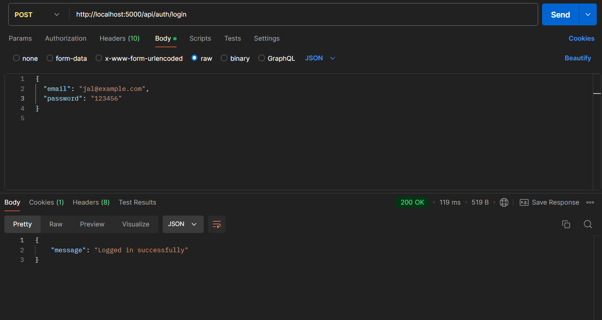
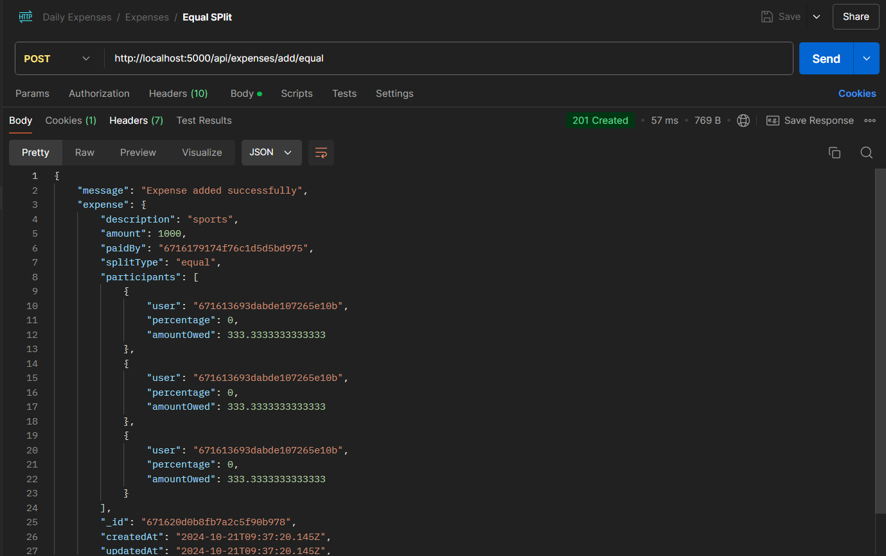
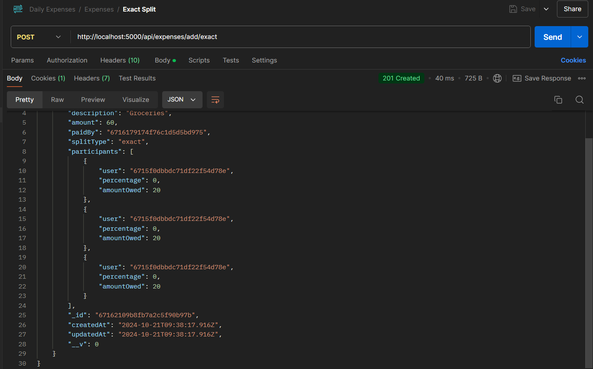
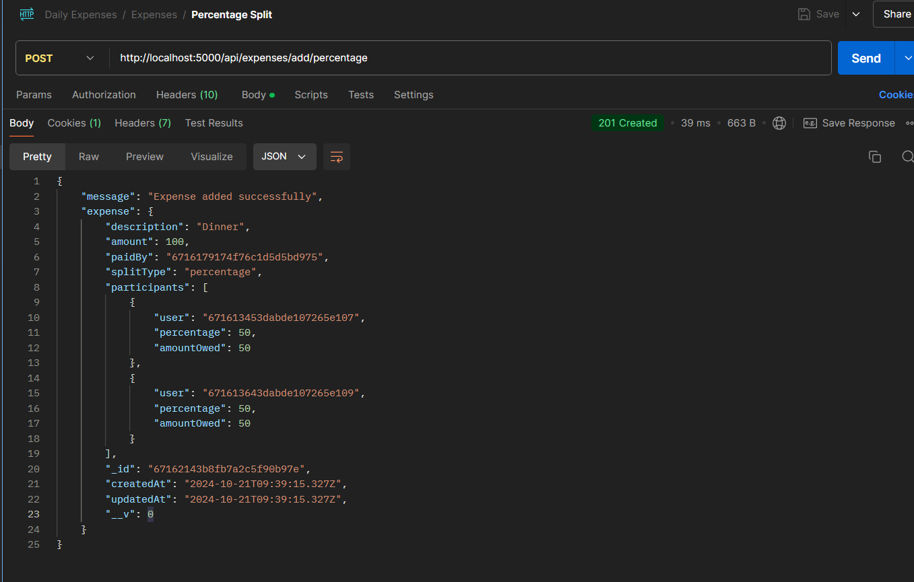
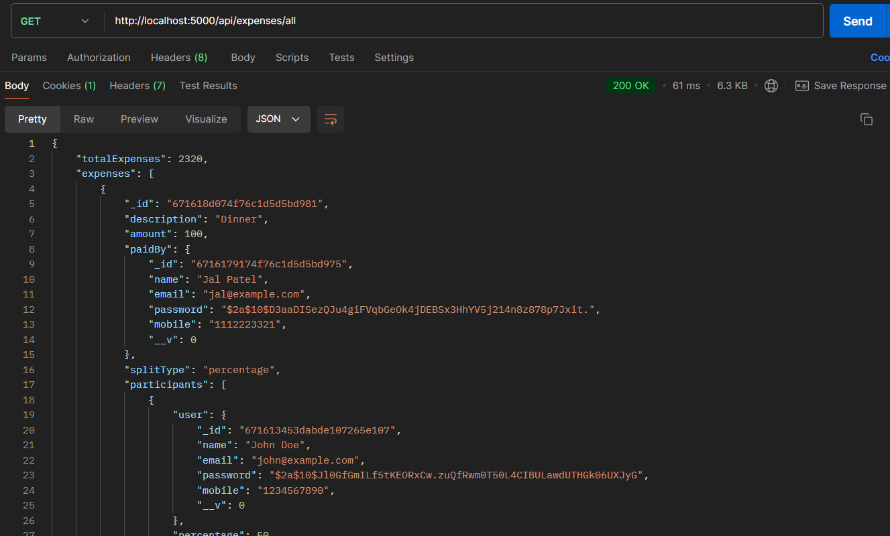
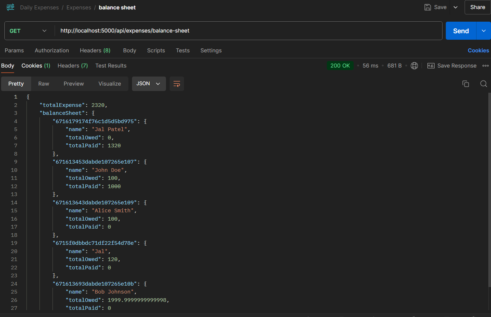

# Expense Tracker

A web application for managing shared expenses among users. It allows users to add expenses, split them equally, by percentage, or by exact amounts, and view their overall balances.

## Features

- User Authentication
- Add Expenses
  - Split by percentage
  - Split equally
  - Exact amounts
- View Overall Expenses
- Generate Balance Sheet

## Technologies Used

- **Node.js**: JavaScript runtime for building the server.
- **Express**: Web framework for building APIs.
- **MongoDB**: NoSQL database for storing user and expense data.
- **Mongoose**: ODM (Object Data Modeling) library for MongoDB and Node.js.
- **JWT (JSON Web Tokens)**: For user authentication.
- **Cookies**: To manage user sessions.

## Installation

1.  Clone the repository:

    ```bash
    git clone https://github.com/Jal-GG/DailyExpense.git
    ```

2.  Environment Setup Instructions
    `bash
cd dailyExpense
`
    Feel free to adjust the example path according to your project structure!

        Rename `.env-example` to `.env`

        Locate the `.env-example` file in your project directory and rename it to `.env`. You can do this using the following command:

        ```bash
        mv .env-example .env
        ```

    3.Edit the .env file
    MONGO_URL = (your mongodb URL)
    JWT_SECRET = (any jwt secret)

3.  # Running the Application

    To start the application, navigate to the directory containing your application files and use the following command:

    ```bash
    node app.js
    ```

## Features

### 1. User Authentication

Secure user login and registration with JWT and cookie-based authentication.


### 2. Expense Tracking

Easily add and manage expenses with different splitting options (equal, percentage, exact).


### 3. Balance Sheet

View a detailed balance sheet showing how much each participant owes.


## **✨ Additional Features that Make Our Application Stand Out! ✨**

- **User Authentication**: Only logged-in users can add expenses, ensuring protection against vulnerabilities and miscalculations.
- **Data Export Options**: Export your expense reports in various formats (CSV, PDF).

## **📡 API Endpoints**

Below are the API endpoints available in this application, along with a brief description of each.

### **1. User Authentication**

- **POST /api/auth/register**

  - **Description**: Register a new user.
  - **Request Body**:
    ```json
    {
      "name": "John Doe",
      "email": "john@example.com",
      "password": "yourpassword",
      "mobile": "1234567890"
    }
    ```
  - **Response**:
    - Success: `201 Created`
    - Error: `400 Bad Request`
  - **Image**: 

- **POST /api/auth/login**
  - **Description**: Log in an existing user.
  - **Request Body**:
    ```json
    {
      "email": "john@example.com",
      "password": "yourpassword"
    }
    ```
  - **Response**:
    - Success: `200 OK`
    - Error: `401 Unauthorized`
  - **Image**: 

### **2. Expense Management**

#### **A. Equal Split Expenses**

- **POST /api/expenses/add/equal**
  - **Description**: Add a new expense with equal split among participants.
  - **Request Body**:
    ```json
    {
      "description": "Dinner",
      "amount": 100,
      "paidBy": "userId",
      "participants": [
        {
          "user": "userId1"
        },
        {
          "user": "userId2"
        }
      ]
    }
    ```
  - **Response**:
    - Success: `201 Created`
    - Error: `400 Bad Request`
  - **Image**: 

#### **B. Exact Amount Expenses**

- **POST /api/expenses/add/exact**
  - **Description**: Add a new expense with exact amounts specified for each participant.
  - **Request Body**:
    ```json
    {
      "description": "Taxi",
      "amount": 80,
      "paidBy": "userId",
      "participants": [
        {
          "user": "userId1",
          "amountOwed": 30
        },
        {
          "user": "userId2",
          "amountOwed": 50
        }
      ]
    }
    ```
  - **Response**:
    - Success: `201 Created`
    - Error: `400 Bad Request`
  - **Image**: 

#### **C. Percentage Split Expenses**

- **POST /api/expenses/add/percentage**
  - **Description**: Add a new expense with percentage shares specified for each participant.
  - **Request Body**:
    ```json
    {
      "description": "Party",
      "amount": 200,
      "paidBy": "userId",
      "participants": [
        {
          "user": "userId1",
          "percentage": 70
        },
        {
          "user": "userId2",
          "percentage": 30
        }
      ]
    }
    ```
  - **Response**:
    - Success: `201 Created`
    - Error: `400 Bad Request`
  - **Image**: 

---

### **3. Retrieve Expenses**

- **GET /api/expenses/all**

  - **Description**: Get all expenses recorded in the application.
  - **Response**:
    - Success: `200 OK`
    - Error: `400 Bad Request`
  - **Image**: 

- **GET /api/expenses/balance-sheet**
  - **Description**: Get the balance sheet summarizing total expenses and how much each participant owes.
  - **Response**:
    - Success: `200 OK`
    - Error: `400 Bad Request`
  - **Image**: 

---

### **4. Additional Features**

- **Security**: Only logged-in users can add expenses, ensuring protection against vulnerabilities and miscalculations.
